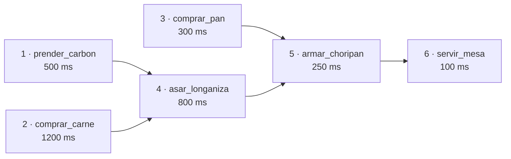
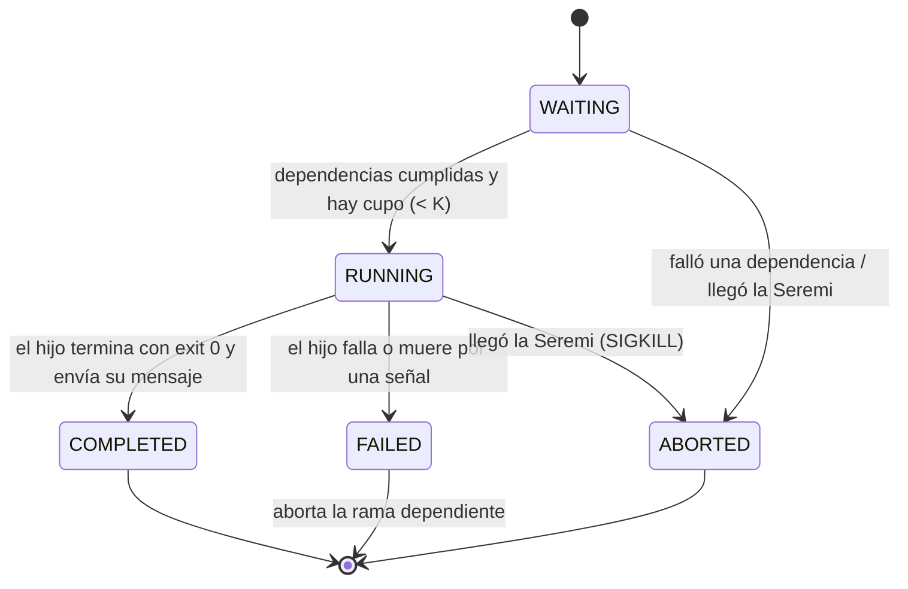

<div align="center">

# 🔥 El Planificador Dieciochero

**Simulador y planificador de actividades modeladas como un grafo acíclico dirigido (DAG),<br>construido con `fork`, `pipe` y señales POSIX.**


_Tarea 1 · Sistemas Operativos · Universidad Diego Portales_

</div>

---

## 📖 Descripción

El señor Loyola celebrará las Fiestas Patrias **la semana completa** y, como buen organizado, planifica la ramada como un sistema: cada día es un **DAG de actividades** con duraciones y dependencias.

Este programa lee ese plan (`plan.txt`), lanza cada actividad como un **proceso hijo independiente** en cuanto sus dependencias terminan, respeta un **límite de concurrencia K**, propaga mensajes entre actividades mediante **pipes**, aísla los fallos y reacciona a la **inspección de la Seremi (Ctrl+C)** abortándolo todo.

## ✨ Características

|     | Característica              | Cómo se implementa                                                              |
| --- | --------------------------- | ------------------------------------------------------------------------------- |
| 🔀  | **Ejecución concurrente**   | Un `fork()` por actividad; nunca hay más de **K** hijos vivos                   |
| 📨  | **Paso de mensajes**        | Un `pipe` por hijo; el mensaje de cada actividad llega a sus dependientes       |
| 🧯  | **Aislamiento de errores**  | Si una actividad falla, solo se aborta **su rama** (en cadena y recursivamente) |
| 🚔  | **Inspección de la Seremi** | `SIGINT` (Ctrl+C) aborta todo, reapea los hijos y no deja zombies               |
| 🎲  | **Duración aleatoria**      | Si `tiempo_ms` está vacío se sortea entre 100 y 5000 ms                         |
| 🧠  | **Detección de deadlock**   | Dependencias inexistentes o ciclos se detectan y no cuelgan el programa         |
| 🏋️  | **Pruebas de estrés**       | Probado con 10.000 actividades                                                  |
| 🚫  | **Sin hilos**               | Solo procesos, pipes y señales                                                  |

## 📁 Estructura del proyecto

```
.
├── main.c        # Planificador: bucle principal, fork, pipes, señales
├── dag.c / .h    # Parser de plan.txt y aborto recursivo de ramas
├── tipos.h       # Task, Message y estados (WAITING, RUNNING, ...)
├── utilidad.c/.h # trim(): limpieza de espacios y saltos de línea
├── plan.txt      # Plan de ejemplo
└── makefile
```

## 🛠️ Requisitos

- Linux, macOS o cualquier entorno Unix (POSIX)
- `gcc` con soporte para `-std=c17`
- `make`

## 🚀 Compilación y ejecución

```bash
# Compilar (usa -Wall -Wextra -std=c17)
make

# Ejecutar:  ./planificador <plan.txt> <K>
./planificador plan.txt 2

# Limpiar archivos generados
make clean
```

| Argumento  | Descripción                                          |
| ---------- | ---------------------------------------------------- |
| `plan.txt` | Archivo con las actividades y sus dependencias       |
| `K`        | Máximo de procesos concurrentes (si es ≤ 0 se usa 1) |

## 📝 Formato del plan

Cada línea describe una actividad:

```
ID : Nombre : tiempo_ms : Dep1, Dep2, ...
```

```text
1 : prender_carbon : 500 :
2 : comprar_carne : 1200 :
3 : comprar_pan : 300 :
4 : asar_longaniza : 800 : 1, 2
5 : armar_choripan : 250 : 3, 4
6 : servir_mesa : 100 : 5
```

- **ID**: identificador único alfanumérico (máx. 31 caracteres).
- **Nombre**: etiqueta descriptiva (máx. 127 caracteres).
- **tiempo_ms**: duración en milisegundos. Vacío ⇒ aleatorio entre 100 y 5000.
- **Dependencias**: IDs separados por coma que deben terminar antes de arrancar. Vacío ⇒ sin dependencias.
- Se toleran líneas en blanco y archivos con saltos de línea de Windows (`\r\n`).
- Límites: hasta **10.000** actividades y **50** dependencias por actividad.

El ejemplo anterior corresponde a este grafo:



## 🖥️ Ejemplo de salida

`./planificador plan.txt 2`

```text
Iniciando Planificador Dieciochero (Concurrencia: 2)...
Iniciando: prender_carbon (PID: 109, Tiempo: 500ms)
Iniciando: comprar_carne (PID: 110, Tiempo: 1200ms)
 Completado: prender_carbon. Insumo 'prender_carbon' procesado y listo.
Iniciando: comprar_pan (PID: 111, Tiempo: 300ms)
 Completado: comprar_pan. Insumo 'comprar_pan' procesado y listo.
 Completado: comprar_carne. Insumo 'comprar_carne' procesado y listo.
   [asar_longaniza] recibio insumo de 'prender_carbon': Insumo 'prender_carbon' procesado y listo.
   [asar_longaniza] recibio insumo de 'comprar_carne': Insumo 'comprar_carne' procesado y listo.
Iniciando: asar_longaniza (PID: 112, Tiempo: 800ms)
 ...
 Completado: servir_mesa. Insumo 'servir_mesa' procesado y listo.

Finalizado. (Completadas: 6, Abortadas: 0)
```

Con `K = 2` nunca corren más de dos actividades a la vez; `comprar_pan` espera a que se libere un cupo.

## 🧩 ¿Cómo funciona?



1. **Parseo:** `parse_plan()` lee el archivo y llena un arreglo de `Task`.
2. **Lanzamiento:** el padre recorre las tareas `WAITING` con todas sus dependencias cumplidas y, mientras haya menos de **K** procesos activos, crea un pipe y hace `fork()`.
3. **Ejecución:** cada hijo imprime los insumos que recibió, duerme `tiempo_ms` con `nanosleep`, escribe su `Message` por el pipe y termina con `_exit(0)`.
4. **Recolección:** el padre reapea con `waitpid(WNOHANG)`, lee el mensaje **de ese hijo**, lo guarda y lo entrega a cada actividad dependiente. Si no terminó nadie, duerme con `sigsuspend()`.
5. **Fallos:** si un hijo termina con error o por una señal, la tarea pasa a `FAILED` y `abort_branch()` aborta recursivamente solo a sus descendientes.
6. **Seremi:** `SIGINT` se maneja con máscaras de señales (sin condiciones de carrera); se mata y reapea a los hijos activos y el resto se marca como abortado.

### Decisiones de diseño

- **Un pipe por hijo** → cada mensaje se asocia sin ambigüedad a su actividad, aunque varios hijos terminen a la vez.
- **`_exit()` en el hijo** → no vacía los buffers de `stdio` heredados del padre; evita líneas duplicadas cuando la salida se redirige a un archivo.
- **`sigprocmask` + `sigsuspend`** → desbloqueo y espera atómicos: ninguna señal se pierde entre la revisión de la bandera y la espera.
- **Restauración de señales en el hijo** → con Ctrl+C la terminal envía `SIGINT` a todo el grupo de procesos; los hijos mueren con la acción por defecto.

## 🧪 Cómo probarlo

**Fallo de una actividad** (en otra terminal, mata al hijo de `comprar_carne`):

```bash
./planificador plan.txt 3 &
kill -9 $(pgrep -P $! | sort -n | sed -n 2p)
```

Solo se aborta la rama `asar_longaniza → armar_choripan → servir_mesa`.

**Fallas internas simuladas** (probabilidad en % de que cada actividad falle):

```bash
PROB_FALLA=40 ./planificador plan.txt 3
```

**Inspección de la Seremi:** ejecuta el programa y presiona `Ctrl+C`.

**Deadlock:** una dependencia que no existe (`2 : b : 100 : 99`) se detecta y el programa termina con un mensaje de error.

**Estrés con 10.000 actividades:**

```bash
python3 -c "
for i in range(1, 10001):
    print(f'{i} : t{i} : 1 :' + ('' if i <= 100 else f' {i-100}, {i-99}'))
" > big.txt

time ./planificador big.txt 50 > salida.txt
tail -1 salida.txt   # Finalizado. (Completadas: 10000, Abortadas: 0)
```

## ⚙️ Restricciones técnicas cumplidas

- ✅ C con `gcc -Wall -Wextra -std=c17`, sin warnings
- ✅ Compila en entornos Unix
- ✅ Sin hilos ni mecanismos de sincronización de hilos
- ✅ Concurrencia limitada por **K**
- ✅ Paso de mensajes por **pipes**
- ✅ Aislamiento de errores por rama
- ✅ Manejo de **SIGINT**

## 👥 Autores

| Nombre               | GitHub                                   |
| -------------------- | ---------------------------------------- |
| _Sebastian Quintero_ | [@sebas910](https://github.com/sebas910) |
| _Alan Troncoso_      | [@3speon](https://github.com/3speon)     |

<div align="center">

_Hecho con ❤️, carbón y mucha longaniza. ¡Viva Chile CTM! 🇨🇱_

</div>
